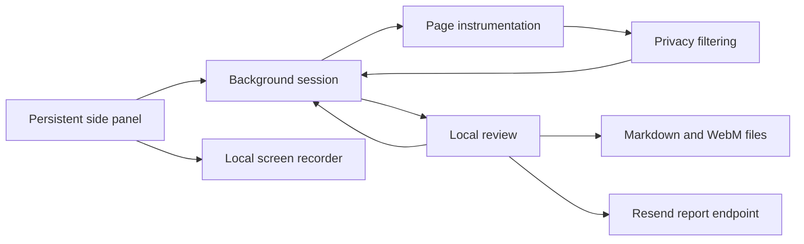

# ReproKit

> A local-first Chrome extension that turns vague bug reports into privacy-filtered reproduction evidence.

ReproKit records the human steps and browser failures that maintainers usually have to request after a bug is reported. A user starts capture on the affected tab, reproduces the problem, reviews every saved field and the tab recording locally, and exports a Markdown issue plus an optional WebM. Nothing leaves the browser unless the user explicitly chooses **Email report**.

**Current status:** public v0.1.0 pre-release. Download the verified Chrome archive from [GitHub Releases](https://github.com/montasim/ReproKit/releases/latest), or visit the [ReproKit landing page](https://reprokit-679.netlify.app).

## What works today

- Explicit start and stop controls scoped to one browser tab
- Manual, ordered reproduction steps
- All console levels plus uncaught error and unhandled rejection capture
- Fetch, XHR, and page-resource network evidence with method, status, duration, and URL
- Bounded text/JSON request and response bodies for fetch and XHR
- Same-origin reload recovery
- Reviewable interruption when the tab changes origin or is closed
- Original page URL, title, browser, platform, and ReproKit version metadata
- Local tab screen recording without microphone or tab audio
- Final-frame screenshot fallback when Chrome cannot start video capture
- Persistent Chrome side panel that remains open while the bug is reproduced
- Local filtering for URL queries, email addresses, bearer tokens, and secret-like fields
- Editable title, expected behavior, actual behavior, and reproduction steps
- Removal of individual console, network, and visual evidence before export
- Locally downloaded, descriptively named Markdown and WebM files
- Explicit report delivery to a fixed maintainer address through a server-side Resend integration

ReproKit does not currently capture feature flags, automatic interaction steps, application versions supplied by an SDK, WebSocket frames, or remote GitHub/Linear issues. Those belong to later product stages, not this MVP.

## Install the source build

### Requirements

- Node.js 24 or newer
- pnpm 11.7.0
- Chrome 120 or newer
- A Resend account and verified sending domain only when enabling email delivery

### Build and load ReproKit

```bash
pnpm install
pnpm build:extension
```

Then open `chrome://extensions` in Chrome:

1. Enable **Developer mode**.
2. Select **Load unpacked**.
3. Choose `apps/extension/.output` from this repository.
4. Pin ReproKit to the toolbar if you want it immediately accessible.

The built manifest requests `activeTab`, `desktopCapture`, `scripting`, `sidePanel`, `storage`, and `tabs`. The `tabs` permission lets the persistent side panel identify the selected page and read its URL/title; ReproKit does not enumerate or retain browser history. Host access is optional and requested only for the current site when the user begins capture. Chrome remembers an approved site until the user revokes it in extension settings.

Selecting the toolbar icon opens ReproKit in Chrome’s right-side panel. The panel remains available while the user interacts with the recorded page.

## Capture a bug

1. Open the page where the bug occurs.
2. Select ReproKit from the Chrome toolbar and choose **Choose tab & start**, then select the affected tab in Chrome’s chooser.
   On the first capture for a site, approve Chrome’s site-access prompt.
3. Reproduce the failure. Add concise manual steps as you work.
4. Select **Stop & review** on the recorded tab.
5. Complete the title, expected behavior, and actual behavior.
6. Remove anything you do not want to share, then choose **Save changes**. Saving applies local privacy filtering to edited content.
7. Download or copy the Markdown report, or choose **Share by email** to send it to the configured maintainer. Download the screen recording separately when it is too large to email.

If the recorded tab moves to another origin or is closed, ReproKit preserves the evidence collected up to that point and marks the capture as interrupted. Same-origin reloads continue recording automatically.

## Privacy boundary

Captured data remains in extension-owned browser storage until the user deletes it or starts another capture. ReproKit deliberately excludes:

- Page HTML and DOM snapshots
- Cookies and browser storage
- Form values and keystrokes
- Clipboard contents
- Request and response headers

Console values and text/JSON network bodies are bounded and serialized before storage. Binary and oversized response bodies are omitted. Known secret-shaped keys and text patterns are replaced with `[REDACTED]`; URL query strings are removed. Resource requests outside fetch and XHR include metadata but not bodies. Filtering is a safety layer, not a guarantee that arbitrary sensitive text can always be recognized. Review every field, network payload, and screen recording before publishing the exported files.

Screen recordings may contain visible personal or confidential information because they reproduce the selected tab’s pixels. ReproKit does not record microphone or tab audio. The video can be removed during review. Chrome may refuse screen capture on restricted pages; ReproKit then attempts a final-frame screenshot fallback.

Email is an explicit network boundary. Choosing **Email report** sends the reviewed Markdown and visual evidence up to 4 MiB to the configured ReproKit server, which forwards it to a fixed recipient through Resend. Larger visual artifacts remain local and only the Markdown is sent. The Resend API key and recipient address exist only on the server; they are never bundled into the extension.

## Configure report email

Copy `.env.example` to `.env` and set:

- `RESEND_API_KEY` to a server-side Resend key.
- `REPROKIT_REPORT_FROM` to an address on your verified Resend domain.
- `REPROKIT_REPORT_TO` to the fixed maintainer address (or comma-separated addresses).
- `REPROKIT_EXTENSION_ORIGIN` to the installed production extension origin.
- `VITE_REPROKIT_REPORT_ENDPOINT` to the deployed `/api/reports` endpoint when building the extension.

For local development, the extension defaults to `http://localhost:3000/api/reports`; run `pnpm dev:web` with the server variables configured. Production builds do not fall back to localhost: without `VITE_REPROKIT_REPORT_ENDPOINT`, the review page clearly marks email as unavailable and requests no report-server host permission. Set the deployed endpoint before `pnpm build:extension` to enable **Share by email** and include only that API origin in Chrome's host permissions. The endpoint accepts extension origins only, limits each client to five requests per hour per running server instance, fixes the recipient server-side, and uses the capture ID as the Resend idempotency key.

## Try the deterministic fixture

Build and load the extension, then serve the included broken checkout page:

```bash
python3 -m http.server 4173 --bind 127.0.0.1 --directory examples/broken-web-app
```

Open [http://127.0.0.1:4173](http://127.0.0.1:4173), start ReproKit, and select **Complete payment**. The fixture emits a console error containing known email and authorization values so the capture and redaction behavior can be checked safely.

## Repository structure

```text
apps/extension        WXT Manifest V3 side panel, review page, and background worker
apps/web              TanStack Start landing page
packages/capture-model  Zod schemas and extension message contracts
packages/privacy      Deterministic text and URL filtering
packages/issue-export Markdown issue validation and rendering
examples              Deterministic browser fixture
```

The background worker owns session transitions and capture lifecycle. The persistent side panel records the tab selected through Chrome’s chooser, while page instrumentation sends bounded console and network events through an isolated bridge. The session store applies privacy filtering before persistence, while video and fallback screenshot blobs live in extension-owned IndexedDB. Review edits return through the background protocol before export or explicit server-side email delivery.



The project vocabulary and boundaries are documented in [CONTEXT.md](CONTEXT.md). Planned stages and architectural decisions are in [IMPLEMENTATION_PLAN.md](IMPLEMENTATION_PLAN.md).

## Development

Install dependencies once, then use the appropriate workspace command:

| Command                | Purpose                                                       |
| ---------------------- | ------------------------------------------------------------- |
| `pnpm dev:extension`   | Start WXT extension development mode                          |
| `pnpm dev:web`         | Start the landing page                                        |
| `pnpm build:extension` | Create the unpacked Chrome build                              |
| `pnpm build:web`       | Build the landing page                                        |
| `pnpm test`            | Run workspace tests                                           |
| `pnpm lint`            | Run workspace linting                                         |
| `pnpm typecheck`       | Run strict TypeScript checks                                  |
| `pnpm check`           | Format-check, lint, type-check, test, and build the workspace |
| `pnpm release:zip`     | Verify and package the Chrome extension ZIP                   |

Before opening a contribution, run:

```bash
pnpm check
```

The CI workflow runs the same command for pushes to `main` and pull requests. Version tags matching `v*` trigger the release workflow, which creates a Chrome ZIP, validates its layout, generates `SHA256SUMS.txt`, and attaches both files to the GitHub release.

## Current limitations

- Chrome is the only supported browser target.
- Only one capture session can be active at a time.
- Capture is limited to regular HTTP and HTTPS pages where Chrome grants temporary access.
- Cross-origin navigation ends the capture instead of continuing across sites.
- Screen recording and Markdown are separate files; ReproKit does not attach the video to an issue.
- Visual email attachments are limited to 4 MiB; larger recordings must be downloaded and shared separately.
- The in-memory endpoint rate limit is a baseline abuse control, not a substitute for deployment-level rate limiting in a public release.
- Export creates local files only. It does not publish, authenticate with, or create issues in GitHub or Linear.
- A dedicated support channel, contribution guide, security policy, and code of conduct have not been published yet.
- Automated tests cover model, privacy, lifecycle, review, and export seams; the literal Chrome toolbar permission gesture still requires manual release testing.

## Releases

Version tags matching `v*` run the release workflow. It builds and validates the unpacked Chrome archive, creates `SHA256SUMS.txt`, and publishes both assets with the installation notes. The latest verified package is available from [GitHub Releases](https://github.com/montasim/ReproKit/releases/latest).

## Support, security, and contributing

Use [GitHub Issues](https://github.com/montasim/ReproKit/issues) for ordinary, non-sensitive bugs. There is no private security-reporting channel yet, so do not publish suspected vulnerabilities, captured reports, recordings, screenshots, credentials, or other sensitive material through a public issue.

The local contribution workflow is available through the development commands above. Dedicated external contribution and governance documents have not been published yet.

## License

No license file has been added yet. The workspace is marked `UNLICENSED`; do not assume permission to copy, modify, or redistribute the code until the maintainer publishes explicit license terms.
