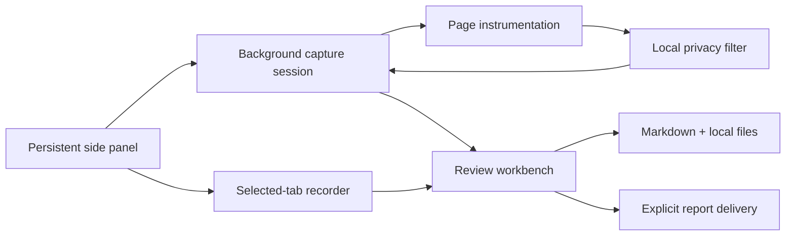

# BugReceipt

> Capture a browser failure once and leave developers a privacy-filtered, reproducible report instead of “the page does not work.”

[](https://github.com/montasim/BugReceipt/actions/workflows/ci.yml)
[](https://github.com/montasim/BugReceipt/releases/latest)
[](apps/extension/wxt.config.ts)
[](https://www.supportkori.com/montasim)

BugReceipt is a local-first Chrome extension for people reporting web application bugs and the developers who must reproduce them. A persistent side panel records the selected tab, collects bounded console and network evidence, keeps manual steps beside the browser context, and opens a review workbench where the reporter decides exactly what to export or explicitly send.

**[Open the landing page](https://bugreceipt.netlify.app) · [Download the latest release](https://github.com/montasim/BugReceipt/releases/latest) · [Try the deterministic fixture](#deterministic-test-fixture) · [Report a non-sensitive bug](https://github.com/montasim/BugReceipt/issues/new/choose)**

**Release status:** the source tree is prepared for version `0.1.3`, targeting Chrome 120 and newer. GitHub Releases distributes BugReceipt as a checksummed, unpacked extension archive; it is not currently available through the Chrome Web Store.

[](https://bugreceipt.netlify.app)

## Why BugReceipt?

A screenshot shows the result of a failure, but rarely the browser evidence or human sequence that produced it. BugReceipt keeps those pieces together while making the sharing boundary explicit:

- capture starts only after the user chooses a tab;
- sensitive diagnostic values are filtered before extension storage;
- recording, console, network, environment, and manual context meet in one review;
- individual evidence can be removed or annotated before export;
- local download is the default, and email delivery requires a separate explicit action.

## What it captures

### During reproduction

- The selected Chrome tab as a WebM recording, without microphone or tab audio
- Console logs, warnings, errors, uncaught exceptions, and rejected promises after capture starts
- Fetch, XHR, and page-resource requests with method, status, duration, filtered URL, and bounded text or JSON bodies where supported
- Ordered reproduction steps added by the reporter
- Page URL, page title, capture time, operating system, browser, platform, raw user agent, and BugReceipt version
- A final screenshot fallback when Chrome cannot produce a screen recording

### During review

- Editable issue title, expected behavior, actual behavior, and reproduction steps
- A video player with **Capture frame** at the current playhead position
- Local selected-frame annotation with select, marker, highlight, border, color, width, undo, redo, and clear controls
- Exact text highlighting inside the Console and Network tabs
- Per-entry removal for console, network, recording, selected-frame, and fallback-screenshot evidence
- Responsive issue inspector and Visual evidence, Console, and Network workspaces

### At export

- GitHub-ready `issue.md` with environment and diagnostic evidence
- Saved console and network highlights represented by explicit `⟦double-bracket⟧` markers
- `recording.webm`, `selected-frame.png`, or fallback `screenshot.png` when available
- One ZIP containing the reviewed files, or the same files in a named folder under Chrome Downloads
- Clipboard copy of the reviewed Markdown
- Optional email delivery through the configured report endpoint

BugReceipt does not currently provide Firefox or Safari support, automatic interaction-step capture, WebSocket frames, feature-flag or application-version SDK capture, or authenticated GitHub/Linear issue creation.

## Install BugReceipt

### From a GitHub release

1. Download the Chrome ZIP and `SHA256SUMS.txt` from the [latest GitHub release](https://github.com/montasim/BugReceipt/releases/latest).
2. Put both files in the same directory and verify the archive.

   Linux:

   ```bash
   sha256sum --check SHA256SUMS.txt
   ```

   macOS:

   ```bash
   shasum -a 256 --check SHA256SUMS.txt
   ```

3. Extract the ZIP to a folder you will keep.
4. Open `chrome://extensions`, enable **Developer mode**, and select **Load unpacked**.
5. Choose the extracted folder containing `manifest.json`, then pin BugReceipt.

Chrome loads the unpacked extension from that folder. Do not delete or move it while BugReceipt is installed. GitHub installations do not update automatically; load each new release from its newly extracted folder, confirm it works, then remove the older unpacked entry.

### Build the current source

Prerequisites:

- Node.js 24 or newer
- pnpm 11.7.0
- Chrome 120 or newer

```bash
git clone https://github.com/montasim/BugReceipt.git
cd BugReceipt
pnpm install --frozen-lockfile
pnpm build:extension
```

Load `apps/extension/.output` through Chrome's **Load unpacked** action. A successful build contains `manifest.json`, `sidepanel.html`, `review.html`, the background worker, compiled chunks, fonts, and icons.

## Capture and export a bug

1. Open a normal HTTP or HTTPS page where the problem occurs.
2. Open BugReceipt from the Chrome toolbar and select **Choose tab & start**.
3. Choose the affected tab in Chrome's share dialog and approve site access when requested.
4. Reproduce the problem and add concise manual steps.
5. Select **Stop & review**.
6. Verify the report fields and inspect Visual evidence, Console, and Network.
7. Pause the recording at the clearest moment and select **Capture frame**; annotate the saved PNG if it improves the evidence.
8. Use **Annotate text** in Console or Network to preserve an exact diagnostic selection. Remove anything that should not be shared.
9. Copy the Markdown, download the report as a ZIP, or save the individual files into one report folder under Downloads.
10. Use **Share by email** only when the build has a configured report endpoint and the reviewed evidence is intended for that recipient.
11. Use **Report an issue** in the review header to email a BugReceipt problem. The optional diagnosis checkbox attaches `diagnosis.md` only after explicit consent.

Same-origin reloads continue the session. Cross-origin navigation or closing the selected tab ends capture and preserves the evidence collected up to that point with an interruption reason.

## Privacy and trust boundary

Captured evidence and annotations stay in extension-owned browser storage until the user deletes them, starts another capture, downloads them, or explicitly emails them. BugReceipt does not directly collect:

- page HTML or DOM snapshots;
- cookies, local storage, or session storage;
- form values, keystrokes, clipboard contents, or request/response headers;
- microphone or tab audio.

Console values and supported text or JSON network bodies are bounded before storage. URL query strings, email addresses, bearer tokens, and secret-shaped fields are filtered locally. Binary and oversized response bodies are omitted. Resource requests outside fetch and XHR include metadata but not bodies.

Filtering reduces risk; it cannot guarantee that every sensitive value will be recognized. Screen recordings can display personal or confidential information rendered by the page. Review every field, highlight, and visual artifact before sharing it.

Email delivery is a separate network boundary. **Share by email** sends `issue.md` plus the same recording, selected frames, or screenshot included in the ZIP to a fixed server-side recipient through Resend. The complete email file set must total no more than 4 MiB; BugReceipt rejects larger sets instead of silently omitting evidence. The Resend key and recipient are never bundled into the extension.

**Report an issue** sends the entered subject and description as `issue.md`. When **Include diagnosis report** is selected, BugReceipt also attaches `diagnosis.md` with the extension version, capture state, page and browser details, evidence counts, and locally filtered console and network metadata. It excludes recordings, screenshots, selected frames, and network request or response bodies.

The manifest requests `activeTab`, `clipboardWrite`, `desktopCapture`, `downloads`, `scripting`, `sidePanel`, `storage`, and `tabs`. Site access is optional and requested for the current origin when capture begins. Report-server access is included only when a production endpoint is configured at build time.

## Configure email delivery

Email is optional. Without a configured endpoint, the review page labels capture sharing **Email unavailable** and disables **Send email** in the issue form while local export remains available.

Copy the safe template:

```bash
cp .env.example .env
```

| Variable                          | Purpose                                                     |
| --------------------------------- | ----------------------------------------------------------- |
| `RESEND_API_KEY`                  | Server-side Resend API key                                  |
| `BUGRECEIPT_REPORT_FROM`          | Sender on a verified Resend domain                          |
| `BUGRECEIPT_REPORT_TO`            | Fixed recipient or comma-separated recipients               |
| `BUGRECEIPT_EXTENSION_ORIGIN`     | Installed production extension origin                       |
| `VITE_BUGRECEIPT_REPORT_ENDPOINT` | Deployed `/api/reports` URL embedded in the extension build |

For local development, the extension uses `http://localhost:3000/api/reports`. Production builds do not fall back to localhost. The endpoint accepts configured extension origins, limits each client to five requests per hour per running server instance, fixes recipients on the server, and derives the Resend idempotency key from the capture ID plus the complete email payload. Identical retries deduplicate, while edited reports or visual evidence can be sent as a new delivery.

Never commit a real `.env` file or put Resend credentials in client-side configuration.

## Deterministic test fixture

The repository includes a deliberately broken checkout page for exercising capture without production data.

```bash
python3 -m http.server 4173 --bind 127.0.0.1 --directory examples/broken-web-app
```

Open [http://127.0.0.1:4173](http://127.0.0.1:4173), start a BugReceipt capture, and select **Complete payment**. The fixture emits known console and network failures containing safe redaction fixtures so recording, review, filtering, annotation, and export can be inspected locally.

## How it works



The root workspace is named `bugreceipt-workspace`. Its background worker owns capture lifecycle and session transitions. Page instrumentation forwards bounded console and network events through an isolated bridge. Filtered session records live in extension storage; recordings, screenshots, selected frames, and annotation documents live in extension-owned IndexedDB. Review edits return through the background protocol before export or email delivery.

```text
apps/extension          WXT Manifest V3 side panel, recorder, review page, and worker
apps/web                TanStack Start landing page and report-delivery endpoint
packages/capture-model  Zod schemas and extension message contracts
packages/privacy        Deterministic text, URL, and diagnostic filtering
packages/issue-export   Markdown and local report rendering
examples/broken-web-app Deterministic browser failure fixture
```

See [CONTEXT.md](CONTEXT.md) for the domain language and [IMPLEMENTATION_PLAN.md](IMPLEMENTATION_PLAN.md) for the staged architecture record. The implementation is authoritative where the plan describes earlier screenshot-only behavior.

## Local development

Install dependencies once from the repository root:

```bash
pnpm install --frozen-lockfile
```

| Command                | Purpose                                                                         |
| ---------------------- | ------------------------------------------------------------------------------- |
| `pnpm dev:extension`   | Start WXT extension development mode                                            |
| `pnpm dev:web`         | Start the landing page and report endpoint on port 3000                         |
| `pnpm build:extension` | Build the unpacked Chrome extension                                             |
| `pnpm build:web`       | Build the TanStack Start application and Netlify function                       |
| `pnpm lint`            | Run workspace ESLint checks                                                     |
| `pnpm typecheck`       | Run strict TypeScript checks                                                    |
| `pnpm test`            | Run workspace tests                                                             |
| `pnpm check`           | Format-check, lint, type-check, test, build, and validate the extension package |
| `pnpm release:zip`     | Run the extension release gate and create its Chrome ZIP                        |

CI runs `pnpm check` for pushes to `main` and pull requests. Browser permission prompts, tab sharing, and unpacked-extension installation still require proportionate manual checks in Chrome.

## Deployment

The public landing page is deployed at [bugreceipt.netlify.app](https://bugreceipt.netlify.app). The root [netlify.toml](netlify.toml) pins the deployable workspace to `apps/web`:

- build command: `pnpm --filter @bugreceipt/web build`;
- Node.js 24 and pnpm 11.7.0;
- client output: `apps/web/dist/client`;
- server output: `apps/web/.netlify/v1/functions`;
- build filtering that skips extension-only changes while retaining web and shared-workspace changes.

Configure the server-side Resend variables only when report email delivery is enabled. Do not put credentials in `netlify.toml` or commit a real environment file.

## Release process

The workspace packages, landing-page release copy, and extension manifest derive from version `0.1.3`. The release validator rejects a built manifest whose version differs from `apps/extension/package.json`.

Before tagging a release:

```bash
pnpm check
pnpm release:zip
```

Inspect the generated Chrome ZIP and confirm `manifest.json` is at its root. Pushing a tag matching `v*` starts the [release workflow](.github/workflows/release.yml), which rebuilds the extension, renames the archive to `BugReceipt-<tag>-chrome-unpacked.zip`, verifies its layout, creates `SHA256SUMS.txt`, and publishes both files with [.github/RELEASE_NOTES.md](.github/RELEASE_NOTES.md).

`v0.1.3` is prepared from the source changes after the published [v0.1.2 release](https://github.com/montasim/BugReceipt/releases/tag/v0.1.2). Historical tags and attached archives remain immutable.

## Troubleshooting

| Problem                              | What to check                                                                                 |
| ------------------------------------ | --------------------------------------------------------------------------------------------- |
| Chrome rejects the extension folder  | Select the extracted directory that contains `manifest.json` directly                         |
| The side panel cannot capture a page | Use a normal HTTP/HTTPS tab; restricted Chrome pages cannot grant site access                 |
| **Download folder** fails            | Check Chrome download permissions and policy, then use **Download ZIP** for the same files    |
| Email is unavailable                 | Build with `VITE_BUGRECEIPT_REPORT_ENDPOINT` and configure the matching server-side variables |
| A recording cannot be previewed      | Preserve the fallback screenshot or retry capture on the affected tab                         |

For ordinary installation and usage help, follow [SUPPORT.md](SUPPORT.md).

## Current limitations

- Chrome desktop is the only supported browser target.
- Only one capture session can be active at a time.
- Restricted browser pages and pages where Chrome denies access cannot be captured.
- Cross-origin navigation ends capture rather than following the user across sites.
- GitHub release installs use Developer mode and do not update automatically.
- Screen recordings and Markdown remain separate GitHub-issue attachments.
- Visual email attachments are limited to 4 MiB.
- The report endpoint's in-memory rate limit is a baseline control, not a distributed production rate limiter.
- Export does not authenticate with or create GitHub or Linear issues.
- Automated tests cannot replace manual verification of Chrome permission, sharing, recording, download, and installation gestures.

## Support, security, and contributing

- [SUPPORT.md](SUPPORT.md) explains how to ask for help without exposing captured data.
- [SECURITY.md](SECURITY.md) defines the private vulnerability-reporting path.
- [CONTRIBUTING.md](CONTRIBUTING.md) documents setup, validation, and privacy expectations for pull requests.
- [GitHub Issues](https://github.com/montasim/BugReceipt/issues/new/choose) accepts ordinary non-sensitive bugs and feature requests.

Never attach an unreviewed capture, production payload, credential, recording, or screenshot to a public issue. Use [GitHub private vulnerability reporting](https://github.com/montasim/BugReceipt/security/advisories/new) for suspected security problems.

## Funding

BugReceipt is maintained independently. Optional support helps fund release verification, hosting, and continued development.

[](https://www.supportkori.com/montasim)

Bug reports, careful reproduction cases, documentation fixes, and code contributions are equally valuable ways to help.

## Author

Built and maintained by [Montasim](https://github.com/montasim).

## License

No license file currently grants permission to copy, modify, or redistribute BugReceipt. The workspace is marked `UNLICENSED`; use is limited to rights provided by applicable law and platform terms until the maintainer publishes an explicit license.
