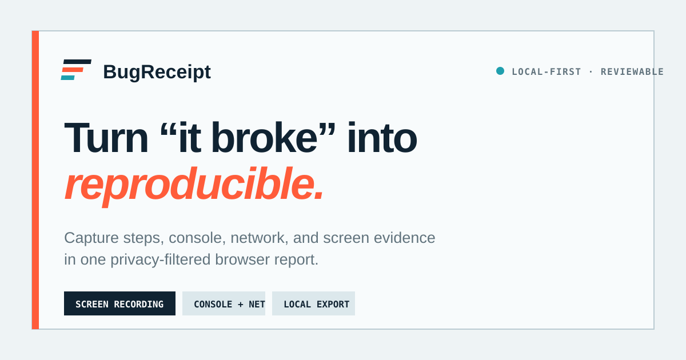
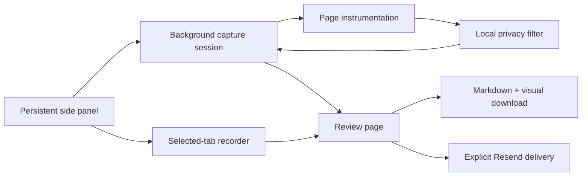

# BugReceipt

> Capture a browser failure once and leave developers a privacy-filtered, reproducible report instead of “the page does not work.”

[](https://github.com/montasim/BugReceipt/actions/workflows/ci.yml)

[Open the landing page](https://bugreceipt.netlify.app) · [Download the latest release](https://github.com/montasim/BugReceipt/releases/latest) · [Report a non-sensitive bug](https://github.com/montasim/BugReceipt/issues/new/choose)



BugReceipt is a local-first Chrome extension for people reporting web application bugs and the developers who must reproduce them. A persistent side panel records the selected tab, collects bounded console and network evidence, accepts manual reproduction steps, and opens a review page where every field can be edited or removed before export or explicit email delivery.

**Status:** version `0.1.2` is a public pre-release for Chrome 120 and newer. It is distributed as a checksummed, unpacked extension archive through GitHub Releases.

## Why BugReceipt?

A screenshot rarely explains how a failure happened. BugReceipt keeps the human sequence, browser evidence, environment, and visual result together while making the sharing boundary explicit.

- Record the selected Chrome tab without microphone or tab audio.
- Capture console logs, warnings, errors, uncaught exceptions, and rejected promises after recording starts.
- Capture fetch, XHR, and page-resource requests with method, status, duration, URL, and bounded text/JSON bodies where supported.
- Add and reorder manual reproduction steps while the failure is visible.
- Review and remove individual console, network, step, and visual-evidence items.
- Export a Markdown report and matching WebM or fallback screenshot locally.
- Send a reviewed report through the configured Resend endpoint only after an explicit user action.

BugReceipt does not currently provide Chrome Web Store installation, Firefox or Safari support, automatic interaction steps, feature-flag or application-version SDK capture, WebSocket frames, or authenticated GitHub/Linear issue creation.

## Install BugReceipt

### From a GitHub release

1. Download the Chrome ZIP and `SHA256SUMS.txt` from the [latest GitHub release](https://github.com/montasim/BugReceipt/releases/latest).
2. Put both files in the same directory and verify the archive:

   ```bash
   sha256sum --check SHA256SUMS.txt
   ```

3. Extract the ZIP to a folder you will keep.
4. Open `chrome://extensions`, enable **Developer mode**, and select **Load unpacked**.
5. Choose the extracted folder containing `manifest.json`, then pin the extension.

Chrome loads the unpacked extension from that folder. Do not delete it while BugReceipt is installed. GitHub installations do not update automatically.

### Build the current source

Requirements:

- Node.js 24 or newer
- pnpm 11.7.0
- Chrome 120 or newer

```bash
git clone https://github.com/montasim/BugReceipt.git
cd BugReceipt
pnpm install --frozen-lockfile
pnpm build:extension
```

Load `apps/extension/.output` through Chrome's **Load unpacked** action. A successful build contains `manifest.json`, the persistent `sidepanel.html`, the review page, scripts, and icons.

The manifest requests `activeTab`, `clipboardWrite`, `desktopCapture`, `scripting`, `sidePanel`, `storage`, and `tabs`. Site access is optional and requested for the current origin when capture begins; report-server access is included only when a production endpoint is configured at build time.

## Capture and export a bug

1. Open a normal HTTP or HTTPS page where the problem occurs.
2. Open BugReceipt from the Chrome toolbar and select **Choose tab & start**.
3. Choose the affected tab in Chrome's share dialog and approve site access when requested.
4. Reproduce the problem and add concise manual steps.
5. Select **Stop & review**.
6. Review the title, expected and actual behavior, steps, console entries, network entries, and visual evidence.
7. Remove anything that should not be shared, then save the edited draft.
8. Download the report bundle, copy the Markdown, or explicitly share the reviewed report by email.

Same-origin reloads continue the session. Cross-origin navigation or closing the selected tab ends capture and preserves the evidence collected so far with an interruption reason.

## Privacy and trust boundary

Captured evidence stays in extension-owned browser storage until the user deletes it, starts another capture, downloads it, or explicitly emails it. BugReceipt does not directly collect:

- page HTML or DOM snapshots;
- cookies, local storage, or session storage;
- form values, keystrokes, clipboard contents, or request/response headers;
- microphone or tab audio.

Console values and supported text/JSON network bodies are bounded before storage. URL query strings, email addresses, bearer tokens, and secret-shaped fields are filtered locally. Binary and oversized response bodies are omitted. Resource requests outside fetch and XHR include metadata but not bodies.

Filtering reduces risk; it cannot guarantee that every sensitive value will be recognized. Screen recordings can display personal or confidential information rendered by the page. Review every field and visual artifact before sharing it.

Email delivery is a separate network boundary. The reviewed Markdown and visual evidence up to 4 MiB are sent to a fixed server-side recipient through Resend only after **Share by email** is selected. Larger visual artifacts remain local. The Resend key and recipient are never bundled into the extension.

Security vulnerabilities belong in [GitHub private vulnerability reporting](https://github.com/montasim/BugReceipt/security/advisories/new), not a public issue. See [SECURITY.md](SECURITY.md) for scope and handling guidance.

## Configure email delivery

Copy the safe template and configure server-side values:

```bash
cp .env.example .env
```

| Variable                          | Purpose                                                     |
| --------------------------------- | ----------------------------------------------------------- |
| `RESEND_API_KEY`                  | Server-side Resend API key                                  |
| `BUGRECEIPT_REPORT_FROM`          | Sender on a verified Resend domain                          |
| `BUGRECEIPT_REPORT_TO`            | Fixed recipient or comma-separated recipients               |
| `BUGRECEIPT_EXTENSION_ORIGIN`     | Installed production extension origin                       |
| `VITE_BUGRECEIPT_REPORT_ENDPOINT` | Deployed `/api/reports` URL embedded in the extension build |

For local development, the extension uses `http://localhost:3000/api/reports`. Production builds do not fall back to localhost. Without `VITE_BUGRECEIPT_REPORT_ENDPOINT`, the review page marks email delivery unavailable and requests no report-server host permission.

The endpoint accepts extension origins only, limits each client to five requests per hour per running server instance, fixes recipients on the server, and uses the capture ID as the Resend idempotency key. Legacy `REPROKIT_*` variables remain accepted for migration.

## Deterministic test fixture

Build and load the extension, then run the included broken checkout page:

```bash
python3 -m http.server 4173 --bind 127.0.0.1 --directory examples/broken-web-app
```

Open [http://127.0.0.1:4173](http://127.0.0.1:4173), start a BugReceipt capture, and select **Complete payment**. The fixture emits known console and network failures containing safe redaction fixtures so capture, review, and filtering can be exercised without production data.

## Architecture

The root workspace manifest is named `bugreceipt-workspace`. The monorepo separates Chrome integration from testable capture, filtering, and export modules:

```text
apps/extension          WXT Manifest V3 side panel, recorder, review page, and worker
apps/web                TanStack Start landing page and report-delivery endpoint
packages/capture-model  Zod schemas and extension message contracts
packages/privacy        Deterministic text, URL, and diagnostic filtering
packages/issue-export   Markdown and local report-bundle rendering
examples/broken-web-app Deterministic browser failure fixture
```



The background worker owns the capture lifecycle and session transitions. Page instrumentation forwards bounded console and network events through an isolated bridge. Filtered session data lives in extension storage; recording and screenshot blobs live in extension-owned IndexedDB. Review edits return through the background protocol before export or email delivery.

See [CONTEXT.md](CONTEXT.md) for the domain vocabulary and [IMPLEMENTATION_PLAN.md](IMPLEMENTATION_PLAN.md) for the staged architecture record. The implementation is authoritative where the plan still describes earlier screenshot-only or local-only behavior.

## Development commands

| Command                | Purpose                                                                         |
| ---------------------- | ------------------------------------------------------------------------------- |
| `pnpm dev:extension`   | Start WXT extension development mode                                            |
| `pnpm dev:web`         | Start the TanStack Start landing page                                           |
| `pnpm build:extension` | Build the unpacked Chrome extension                                             |
| `pnpm build:web`       | Build the landing page and Netlify server output                                |
| `pnpm test`            | Run workspace tests                                                             |
| `pnpm lint`            | Run workspace linting                                                           |
| `pnpm typecheck`       | Run strict TypeScript checks                                                    |
| `pnpm check`           | Format-check, lint, type-check, test, build, and validate the extension package |
| `pnpm release:zip`     | Verify and create the Chrome release archive                                    |

Before opening a pull request:

```bash
pnpm check
```

CI runs the same quality gate for pushes to `main` and pull requests. Tags matching `v*` run the release workflow, which packages the extension, verifies `manifest.json` is at the archive root, generates `SHA256SUMS.txt`, and attaches both files to a GitHub release.

## Landing-page deployment

The public site is [bugreceipt.netlify.app](https://bugreceipt.netlify.app). The root `netlify.toml` defines the reproducible Netlify contract and pins the deployable workspace to `apps/web`:

- build command: `pnpm --filter @bugreceipt/web build`;
- Node.js 24 and pnpm 11.7.0;
- TanStack Start with `@netlify/vite-plugin-tanstack-start`;
- client publish directory: `dist/client`, with SSR output emitted as a Netlify function;
- build filtering that skips extension-only commits while retaining web and shared-workspace changes.

The site requires the server-side Resend variables only when report email delivery is enabled. Do not put credentials in `netlify.toml` or commit a real `.env` file.

## Current limitations

- Chrome desktop is the only supported browser target.
- Only one capture session can be active at a time.
- Restricted browser pages and pages where Chrome denies access cannot be captured.
- Cross-origin navigation ends the capture rather than following the user across sites.
- GitHub release installs are unpacked Developer mode installs and do not update automatically.
- Screen recording and Markdown remain separate GitHub-issue attachments.
- Visual email attachments are limited to 4 MiB.
- The report endpoint's in-memory rate limit is a baseline control, not a distributed production rate limiter.
- Export does not authenticate with or create GitHub or Linear issues.
- Automated tests cannot replace manual verification of Chrome's toolbar permission and tab-sharing gestures.

## Releases and verification

Release tags are immutable evidence. Version `v0.1.2` is the current BugReceipt archive. The historical `v0.1.0` and `v0.1.1` tags and attached archives remain unchanged.

For any release, download the ZIP and checksum into the same directory, then run:

```bash
sha256sum --check SHA256SUMS.txt
unzip -Z1 BugReceipt-vX.Y.Z-chrome-unpacked.zip | grep -Fx manifest.json
```

The first command verifies the downloaded bytes. The second confirms Chrome's required unpacked manifest is at the archive root. Replace `vX.Y.Z` with the exact published filename.

## Support and contributing

- [SUPPORT.md](SUPPORT.md) explains how to ask for help without exposing captured data.
- [SECURITY.md](SECURITY.md) defines the private vulnerability-reporting path.
- [CONTRIBUTING.md](CONTRIBUTING.md) documents setup, validation, and privacy expectations for pull requests.
- [GitHub Issues](https://github.com/montasim/BugReceipt/issues/new/choose) accepts ordinary non-sensitive bugs and feature requests.

## License

No license file grants permission to copy, modify, or redistribute BugReceipt. The workspace is marked `UNLICENSED`; use is limited to rights provided by applicable law and platform terms until the maintainer publishes an explicit license.
