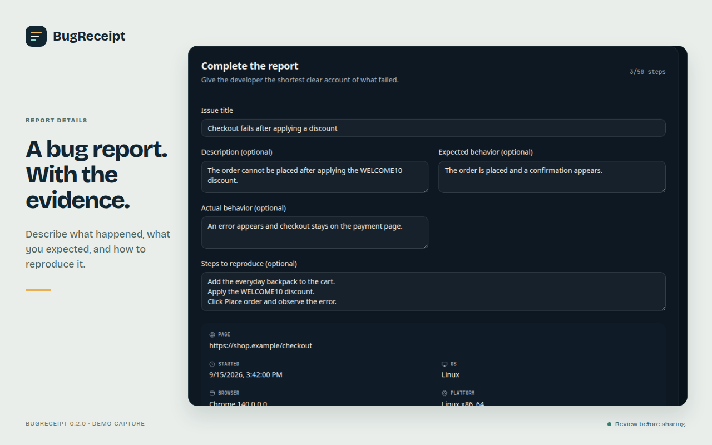

# BugReceipt

BugReceipt is a local-first Chrome extension for reporting web application bugs with more than a screenshot. It records a selected tab, collects bounded browser diagnostics, and lets reporters review and remove evidence before exporting a reproducible report. It is built for QA testers, support teams, developers, and anyone who needs to explain a browser failure clearly.

**[Install from the Chrome Web Store](https://chromewebstore.google.com/detail/bugreceipt/dcjbnkadoenmkcimidcbhhckdpaondae) · [Visit the product site](https://bugreceipt.netlify.app) · [Get help](SUPPORT.md)**



The Chrome Web Store currently lists version 0.1.6; this source tree is version 0.2.0. The store listing and this repository may therefore differ until a new store version is published. The repository also publishes [checksummed, unpacked Chrome archives](https://github.com/montasim/BugReceipt/releases) for manual installation.

## What you can do

- Record the selected Chrome tab as WebM without microphone or tab audio, and add reproduction steps as the problem occurs.
- Capture console messages, exceptions, and bounded network evidence from the moment capture starts. The recorder includes supported document and resource requests, redirect hops, request headers, and available text or JSON response bodies.
- Review the recording, capture up to 20 frames, annotate selected images, highlight exact console or network text, and remove evidence that should not be shared.
- Edit the issue title, expected and actual behavior, and steps before exporting a local ZIP containing `issue.md` and available visual files. Console JSON and network HAR can be downloaded separately.

BugReceipt does **not** automatically create a GitHub issue or upload the capture. The **Report an issue** action opens a blank GitHub issue form; you decide what to attach.

## Install and make a first report

1. [Add BugReceipt from the Chrome Web Store](https://chromewebstore.google.com/detail/bugreceipt/dcjbnkadoenmkcimidcbhhckdpaondae) and pin it to the toolbar.
2. Open an ordinary HTTP or HTTPS page where the bug occurs. For a safe local example, use the [deterministic test page](#try-the-deterministic-test-page).
3. Open BugReceipt and select **Choose tab to record**. In Chrome's share dialog, choose the affected tab.
4. Reproduce the problem, add manual steps, then select **Stop & review**.
5. Inspect the Visual evidence, Console, and Network tabs. Edit the report and remove anything private.
6. Select **Download as ZIP**. The downloaded archive contains `issue.md` plus any recording, selected-frame PNGs, or fallback screenshot retained in the review.

Start capture _before_ refreshing or reproducing the bug: earlier console and network events cannot be recovered. A same-origin reload remains in the session; cross-origin navigation or closing the selected tab ends capture and records why it stopped.

### Try the deterministic test page

The repository includes a deliberately broken checkout page with known console and network failures. From the repository root, run:

```sh
python3 -m http.server 4173 --bind 127.0.0.1 --directory examples/broken-web-app
```

Open [http://127.0.0.1:4173](http://127.0.0.1:4173), start a BugReceipt capture, and select **Complete payment**. Review the resulting evidence locally; the fixture does not need production data.

## Build from source

You need Node.js 24 or newer, pnpm 11.7.0, and Chrome 125 or newer for the current source build.

```sh
git clone https://github.com/montasim/BugReceipt.git
cd BugReceipt
pnpm install --frozen-lockfile
pnpm build:extension
```

The successful build writes `manifest.json`, `sidepanel.html`, `review.html`, background code, assets, and icons to `apps/extension/.output`. Open `chrome://extensions`, turn on **Developer mode**, select **Load unpacked**, and choose that output folder. Keep the folder in place while using the unpacked extension.

For a release archive, run `pnpm release:zip`; it creates `apps/extension/.output/BugReceipt-<version>-chrome.zip` after the extension checks. Unpack that ZIP before using **Load unpacked**. A manually loaded archive does not receive Chrome Web Store updates.

## Privacy and limitations

Capture data and annotations are held in extension-owned browser storage and IndexedDB. Complete reports are exported locally, not automatically uploaded or emailed. BugReceipt filters supported diagnostic values before storage, including URL query strings, email addresses, bearer tokens, secret-shaped fields, and recognized sensitive request headers. Binary and oversized response bodies are omitted or bounded. The filter is not a guarantee: recordings and screenshots can show anything visible on the page, and unrecognized secrets can still appear in diagnostics. Review every artifact before sharing it.

The extension does not directly collect page HTML or DOM snapshots, cookies, browser storage, form values, keystrokes, clipboard contents, microphone audio, or tab audio. It requests `activeTab`, `desktopCapture`, `debugger`, `sidePanel`, and `storage`, with no host permissions. Chrome's debugger access is needed for console and network evidence; cancelling its debugging banner or another debugger taking over can interrupt capture.

Current constraints:

- Chrome desktop is the supported browser target. Firefox and Safari are not supported by this build.
- Only one capture session can run at a time; restricted browser pages cannot be recorded.
- Diagnostic collection is bounded, not a full DevTools archive. Events before attachment, some browser-internal targets, unavailable response bodies, and dropped events may be absent. The report records capture warnings where available.
- Steps are entered manually; interactions are not automatically tracked. Export does not authenticate with GitHub, Linear, or another issue tracker.
- Screen recordings and the Markdown report must be attached separately if you publish a GitHub issue.

For more on safe reporting, see [SUPPORT.md](SUPPORT.md) and [SECURITY.md](SECURITY.md).

## Repository and development

| Path                      | Role                                                                 |
| ------------------------- | -------------------------------------------------------------------- |
| `apps/extension`          | WXT Manifest V3 side panel, background capture, and review workbench |
| `apps/web`                | TanStack Start product site                                          |
| `packages/capture-model`  | Shared schemas and extension message contracts                       |
| `packages/privacy`        | Diagnostic and URL filtering                                         |
| `packages/issue-export`   | Markdown report rendering                                            |
| `examples/broken-web-app` | Local reproduction fixture                                           |

The background worker owns capture sessions and debugger events. Session records use extension storage; recordings, screenshots, frames, and annotations use extension-owned IndexedDB. Review edits pass through the background protocol before local export. [CONTEXT.md](CONTEXT.md) defines the domain vocabulary; [IMPLEMENTATION_PLAN.md](IMPLEMENTATION_PLAN.md) records the architecture's development history, while the current code is authoritative.

After installing dependencies from the repository root:

| Command                | Purpose                                                                 |
| ---------------------- | ----------------------------------------------------------------------- |
| `pnpm dev:extension`   | Start extension development mode                                        |
| `pnpm dev:web`         | Start the product site on port 3000                                     |
| `pnpm build:extension` | Build the unpacked Chrome extension                                     |
| `pnpm build:web`       | Build the product site for Netlify                                      |
| `pnpm check`           | Check formatting, lint, types, tests, builds, and the extension package |
| `pnpm release:zip`     | Validate and package a Chrome release ZIP                               |

[CI](.github/workflows/ci.yml) runs `pnpm check` on pull requests and pushes to `main`. Browser permission prompts, tab sharing, recording, installation, and downloads still need manual Chrome testing. The product site's [Netlify configuration](netlify.toml) builds `apps/web`; it does not publish the extension. A `v*` tag triggers the [GitHub release workflow](.github/workflows/release.yml), which publishes an unpacked Chrome ZIP and `SHA256SUMS.txt`. Tagging does not update the package or Chrome Web Store version automatically.

## Help and participation

- [SUPPORT.md](SUPPORT.md) covers ordinary installation and usage questions. Do not post an unreviewed capture or production payload in a public issue.
- [SECURITY.md](SECURITY.md) gives the private vulnerability-reporting route.
- [CONTRIBUTING.md](CONTRIBUTING.md) describes local checks and privacy expectations for pull requests.
- [GitHub Issues](https://github.com/montasim/BugReceipt/issues/new/choose) accepts non-sensitive bugs and feature requests.

## License

The workspace is marked `UNLICENSED`, and no license file grants permission to copy, modify, or redistribute BugReceipt. Use is limited to rights provided by applicable law and platform terms until an explicit license is published.
